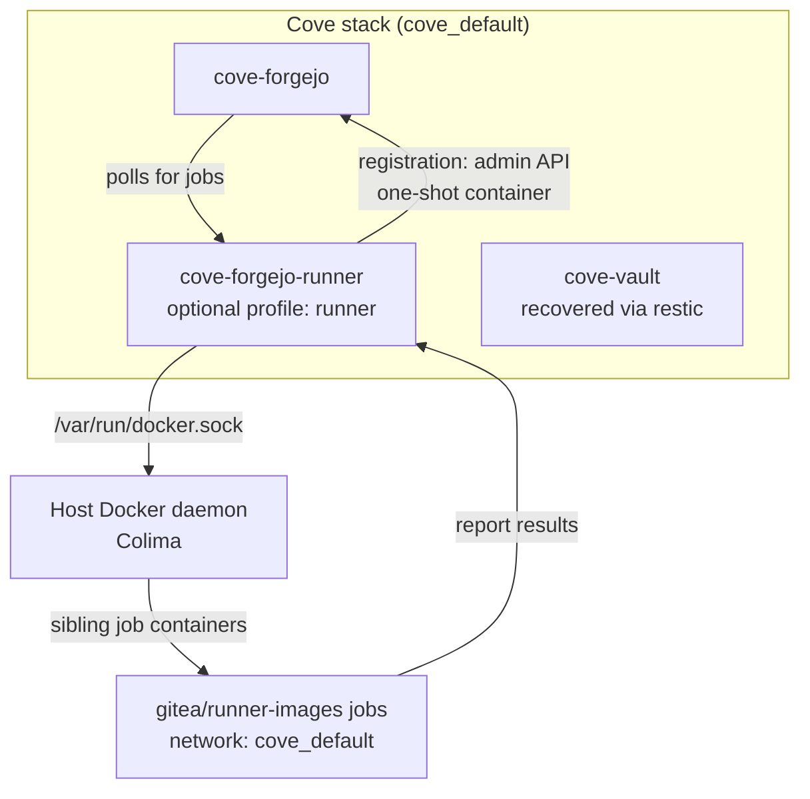

**Responding to:** operator approval ("very well, complete the sashay and merge to main") on PR #49

Final chronicle — sashay closure for **#48 Add Forgejo Actions runner to cove**.

**Verified state at merge:**
- Unit gate: 440 passed, 0 failed (re-run post-rebase, 60s)
- Live acceptance: runner `d8bb985d268b` idle/online in Forgejo admin; trivial echo workflow executed on push (runs #6, #7 success); `project-hal` queued workflow drained (task 1)
- Two review passes clean; 11 branch commits squashing to trunk
- Scratch repo `cristos/runner-smoke-test` deleted after proof (rc 204)

**Deferred Work:**
- Vault-backed workflow secrets (`VAULT_TOKEN` stretch goal from #48): scoped `cove-runner` policy + token minting — see [docs/plans/forgejo-actions-runner.md](https://git.cove/cristos/cove/src/branch/main/docs/plans/forgejo-actions-runner.md) stretch section
- Runner `valid_volumes` wiring for deploy-pages jobs (pages mount inert until configured) — same plan, out-of-scope note
- Job-label image digest pinning (documented as NOT hardened in the service doc trust model)
- Pre-existing litellm staging test staleness (6 failures, unrelated to this branch) + `deploy.sh` not seeding a full `.env` into fresh worktrees (relates to PR #47) — follow-up chore
- Runner config log level ships at `debug` intentionally; drop to `info` once stable

**Diagram changes — C4 L2 (container view), new optional container:**

**Incident note (chronicle 0006):** Vault data was lost during staging debugging and fully restored from restic snapshot `4cbda56f` — no re-init, keys unchanged. Retro to follow (step 13).