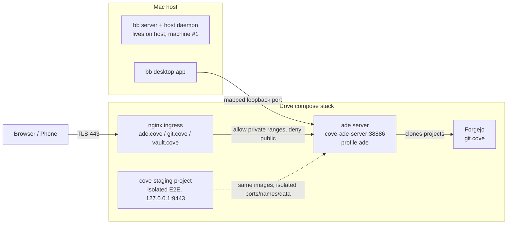

## Final — ADE Phase 1 merged

**Responding to:** operator approval closing the readiness review of PR #55.

Phase 1 of ADR-018 ships: the bb server is a profiled Cove service (`--profile ade`, container `cove-ade-server`, pinned `bb-app@0.43.4`), reachable at `ade.cove` through nginx with WebSocket support and a private-range allow-list, managed by `cove ade up|down|status|logs`. The operator's live bb instance was never touched. Staging E2E now runs as an isolated compose project (`cove-staging`, nginx on 127.0.0.1:9443) and no longer disturbs the live stack.

Verification at close: gate 608 passed / 28 deselected; isolated staging E2E 3 passed live; two review rounds (8 + 3 findings, all fixed, second round re-verified by an independent agent); final rebase onto trunk current; squash-merged with operator authorization.

**Deferred work** (each landed in a durable surface, listed here as pointers only):

- Phase 2 (cutover of the live bb server into the container + host re-enrollment) — `docs/plans/ade-harness-phase1.md` (Out of scope) and `docs/adr/adr-018-ade-agentic-harness.md` (integration shape).
- Phase 3 (`cove ade up` execution-machine containers; provider-auth subscriptions-vs-API-keys decision) — same plan and ADR-018 open questions.
- Ingress auth at nginx (planned control replacing the private-range boundary as the primary one) — `docs/services/ade.md` (Access control) and the ADR-018 implementation note.
- `ade container image build` coverage row remains `manual` in `docs/test-coverage-matrix.yaml` (truthful until a gated build test exists).

### Architecture (C4 L2 — what changed)

No domain-model changes: the ADE is a new service inside the existing single Cove platform context; no bounded-context boundaries moved, no data-model (ERD) changes beyond the ADE's own volume.

**Commits in this unit:** squash-merge of bb/agentic-harness-setup-for-cove-thr_zqcxmdcp5b (21 commits, chronicle interleaved as PR comments).
