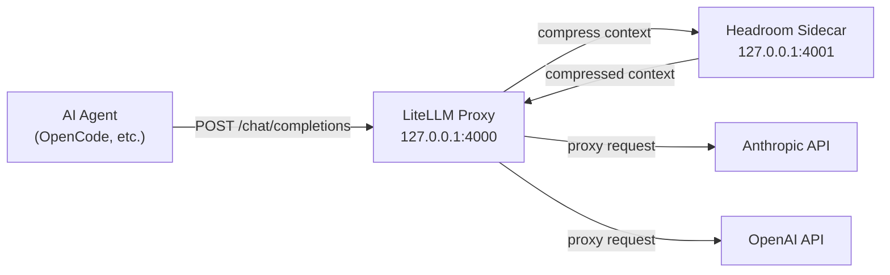

# LiteLLM Proxy for Cove

LiteLLM is a hardened LLM proxy that sits between your AI agents and upstream LLM providers (Anthropic, OpenAI). It provides Headroom context compression as a sidecar, reducing token usage and cost.

## Quick Start

```shell
# Set your API keys
export ANTHROPIC_API_KEY="sk-ant-..."
export OPENAI_API_KEY="sk-proj-..."

# Start the proxy
cove litellm up

# Check it's running
cove litellm status

# Point your tools at http://127.0.0.1:4000
```

The proxy listens on `127.0.0.1:4000` only — no external network exposure.

## What's Hardened

| Layer | Mitigation |
|-------|-----------|
| **Network** | Binds to `127.0.0.1` only. No external exposure. |
| **Version** | Pinned to `litellm==1.84.0` with multi-stage build. |
| **Routes** | Whitelist-only: `/chat/completions`, `/models`, `/health`. All other routes return 404. |
| **Filesystem** | Container runs `read_only: true`. Writable tmpfs for logs and DB. |
| **Supply chain** | Multi-stage build isolates pip install; hash-pinned in requirements. |
| **Base image** | `python:3.13-slim` — minimal package surface. |
| **Credentials** | API keys via environment variables only. No config files with secrets. |
| **Health check** | Docker health check on `/health` with restart policy. |
| **Memory limits** | 512M for LiteLLM, 256M for Headroom. |

## What's NOT Hardened

| Gap | Rationale |
|-----|-----------|
| **Supply chain (full)** | We pin but don't vendor. A PyPI compromise could still inject malware. Mitigation: staged adoption (wait 48-72h after release). |
| **JWT auth** | Disabled by design. Cove is single-user, localhost-only. JWT auth adds attack surface (CVE-2026-35030) with no benefit. |
| **Multi-tenancy** | Not supported. Cove is single-user. |
| **TLS termination** | Not needed for localhost-only. If you expose externally, put a reverse proxy (Caddy, nginx) in front. |

## Credentials Setup

Set these environment variables before running `cove litellm up`:

```shell
export ANTHROPIC_API_KEY="sk-ant-..."
export OPENAI_API_KEY="sk-proj-..."
```

You can also put them in a `.env` file in the project root:

```shell
ANTHROPIC_API_KEY=sk-ant-...
OPENAI_API_KEY=sk-proj-...
```

## Commands

```shell
cove litellm up       # Start the proxy
cove litellm down     # Stop the proxy
cove litellm status   # Check health
cove litellm logs     # Tail logs
cove litellm logs -f  # Follow logs
cove litellm logs -n 100  # Show last 100 lines
```

## Architecture



## Troubleshooting

### Proxy won't start

```shell
cove litellm logs
```

Common causes:
- Port 4000 is already in use: `lsof -i :4000`
- Missing API keys: check `ANTHROPIC_API_KEY` and `OPENAI_API_KEY` are set
- Docker not running: `docker info`

### Headroom model download fails

Headroom downloads a compression model on first start. If it fails:
- Check internet connectivity
- Check `cove-headroom` logs: `docker logs cove-headroom`
- The proxy will still work (Headroom has a "fail open" guarantee)

### OpenCode can't connect

```shell
curl http://127.0.0.1:4000/health
curl http://127.0.0.1:4000/models
```

If both work, configure OpenCode to use the proxy by setting the environment variable:

```shell
export OPENAI_BASE_URL=http://127.0.0.1:4000/v1
```

Or in `opencode.json`:

```json
{
  "provider": "openai",
  "apiBase": "http://127.0.0.1:4000/v1"
}
```

## Upgrade Procedure

1. **Wait 48-72 hours** after a LiteLLM release before upgrading. Let the community find supply chain malware first.
2. Check the [LiteLLM release notes](https://github.com/BerriAI/litellm/releases) and [security advisories](https://github.com/BerriAI/litellm/security/advisories).
3. Update the version pin in `compose/litellm/Dockerfile`:
   ```dockerfile
   RUN pip install --no-cache-dir \
       litellm==<new-version> \
       headroom-ai[all]
   ```
4. Rebuild and restart:
   ```shell
   docker compose -f compose/litellm/docker-compose.yml build
   cove litellm down && cove litellm up
   ```
5. Verify:
   ```shell
   curl http://127.0.0.1:4000/health
   curl http://127.0.0.1:4000/models
   ```
