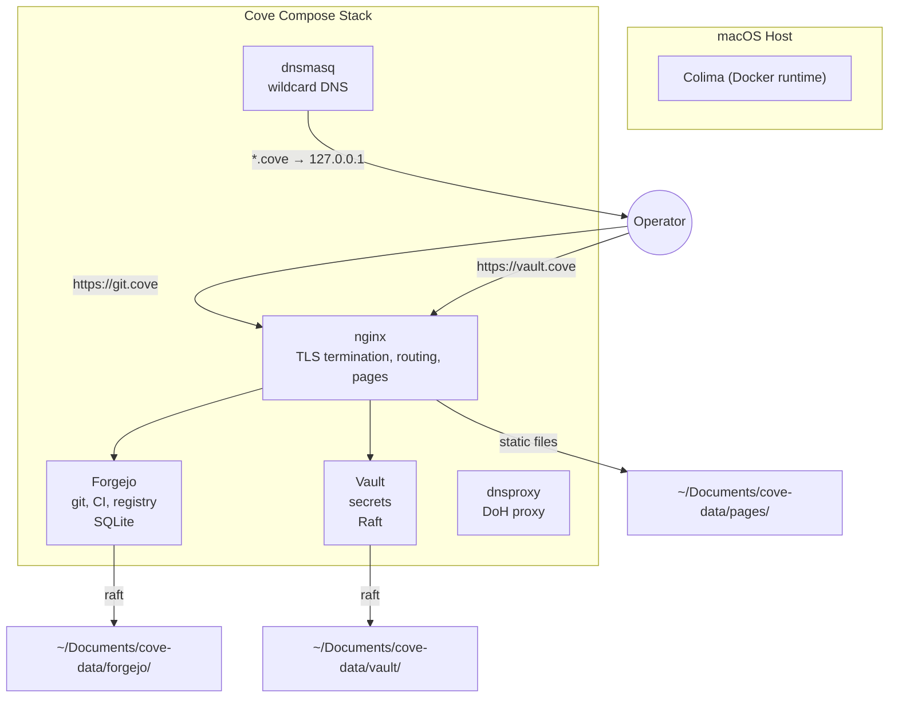
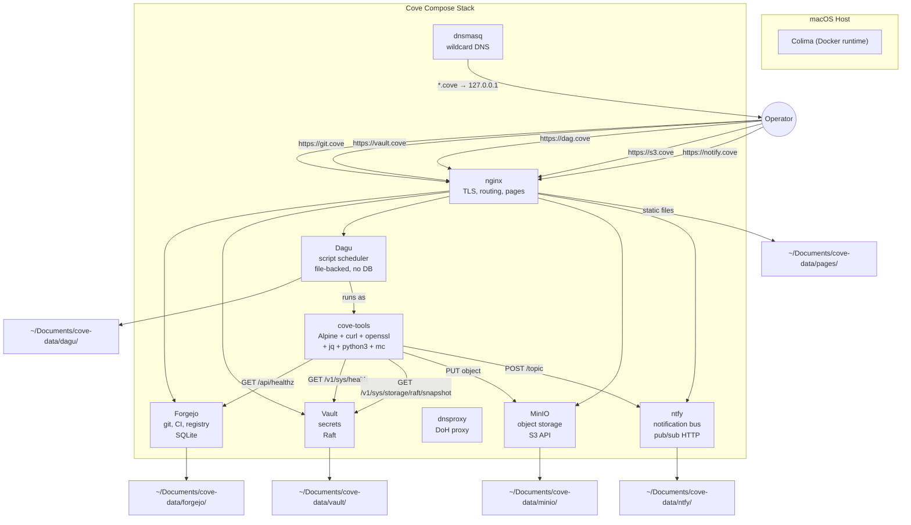
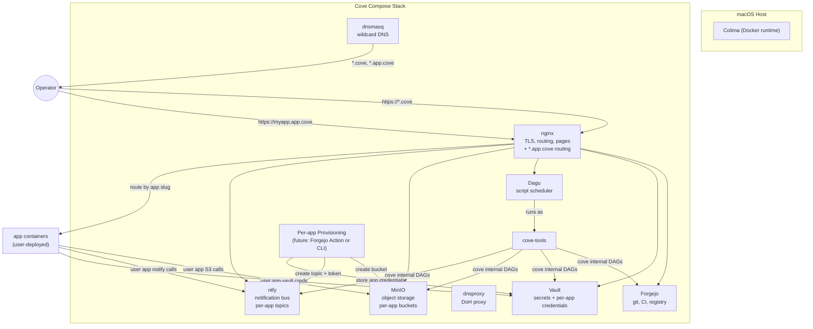

# C4 Diagrams: Dagu in Cove

Four states: current, Dagu MVP, Dagu v1, future (`*.app.cove`).

MVP and v1 are identical — no phasing needed within Dagu scope. The future state adds per-app provisioning but extends the topology rather than rearchitecting it.

## Current State (5 services)

No scheduler, no object storage, no notification bus. Backups are manual. Health checks are manual (`cove status`).

## Dagu MVP / v1 (8 services)

Key properties:
- **No Docker socket access anywhere.** Dagu runs inside cove-tools. All DAG steps are `run:` commands in that image.
- **Dagu is an HTTP client.** It calls Forgejo API, Vault API, MinIO S3 API, ntfy HTTP API. It does not manage any container.
- **MinIO writes to disk.** Objects are real files under `~/Documents/cove-data/minio/`, caught by regular machine backups.
- **ntfy delivers via HTTP.** Operator subscribes via web UI or PWA at `notify.cove`. No macOS-specific notification path needed.
- **MVP = v1.** No phasing within Dagu scope. All three new services (Dagu, MinIO, ntfy) land together because they're interdependent: Dagu needs MinIO for storage, ntfy for notifications.

## Future State (platform: `*.app.cove`)

Key differences from v1:
- **nginx routes `*.app.cove`** to user-deployed app containers (same pattern as current `*.pages.cove`).
- **Per-app provisioning** creates MinIO buckets, ntfy topics+tokens, and Vault credentials for each app.
- **User apps consume platform APIs** — S3, pub/sub, secrets — via the same endpoints Cove internals use.
- **No rearchitecture of the core.** Dagu, MinIO, ntfy, cove-tools are unchanged. The future state adds routing rules, provisioning logic, and app containers — it extends the topology rather than rearchitecting it.

## What This Validates

1. **MVP = v1.** No reason to phase Dagu separately from MinIO/ntfy. They're interdependent.
2. **The topology is forward-compatible.** `*.app.cove` adds routing + provisioning, doesn't touch the core services.
3. **No Docker socket, no proxy, no lethal trifecta** — in any state. Dagu is a pure HTTP client in all diagrams.
4. **MinIO and ntfy are platform services**, not Dagu dependencies. They appear in v1 serving Cove internals, extend naturally to serve user apps.
5. **The cove-tools image is stable across all states.** Same tools (curl, openssl, jq, python3, mc) serve Cove DAGs in v1 and user-app DAGs in the future state.