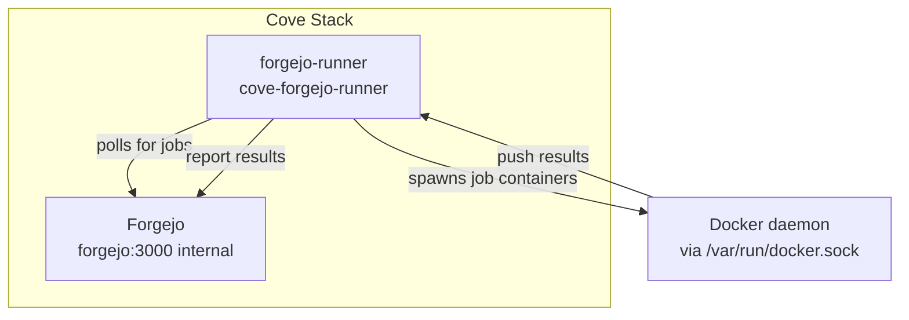

# Forgejo Actions Runner

Optional Cove service that runs Forgejo Actions workflows.

## Quick Start

```bash
cove runner up
```

This starts the runner container with the `runner` compose profile. **The runner
is NOT registered yet.** Run `cove up` (with the runner profile active) to
register it with your Forgejo instance. The runner may restart-loop between
`cove runner up` and registration.

## What It Does

The Forgejo Actions Runner (`forgejo-runner`) polls your Forgejo instance for
pending Actions workflows and executes them inside Docker containers on the
host. It mounts the Docker socket so job containers run as siblings on the host
Docker daemon (Colima on macOS).

The runner is **outbound-only**: it polls Forgejo over the internal network
(`http://forgejo:3000/`) and does not need an nginx ingress route.

## Labels

The runner registers with these labels:

| Label | Image |
|---|---|
| `ubuntu-latest` | `data.forgejo.org/oci/ubuntu:latest` |
| `docker` | `data.forgejo.org/oci/node:lts` |

Jobs can target these labels in their `runs-on` field:

```yaml
jobs:
  build:
    runs-on: ubuntu-latest
```

## Registration (IaC)

Runner registration is handled by `provision_forgejo.yml` (IaC). On `cove up`
with the runner profile active, the playbook:

1. Checks whether the runner is already registered (`.runner` file exists in
   the runner data directory)
2. If not registered, fetches an instance-wide registration token via the
   Forgejo admin API (`GET /api/v1/actions/runners/registration-token`)
3. Runs `forgejo-runner register --no-interactive` inside the runner container
4. Skips registration when the runner container is not running (profile
   inactive)

**Auth posture:** The runner authenticates to Forgejo using a registration token
fetched via the admin-scoped API token (same pattern as `provision_forgejo.yml`
uses for repo and SSH key provisioning). No 1Password seed is needed; the
registration token is ephemeral and derived at provision time.

## What It Does NOT Do

- **No nginx route.** The runner is outbound-only; it does not receive inbound
  connections from browsers or external services.
- **No admin UI.** There is no web dashboard for the runner. Status is checked
  via `cove runner status` or the Forgejo admin panel at
  `https://git.cove.local/admin/actions/runners`.
- **No 1Password seed.** Registration tokens are ephemeral (API-derived). The
  runner has no persistent admin identity in 1Password.
- **Pages mount is inert.** The runner mounts the pages sites directory
  read-write so that `deploy-pages` Actions can write to it, but this mount is
  inert until the runner ships a `config.yml` with `container.valid_volumes`
  configured. The trust model: only trusted repositories should target this
  runner (see "What's Hardened" below).

## Commands

| Command | Description |
|---|---|
| `cove runner up` | Start the runner container (profile: runner) |
| `cove runner down` | Stop the runner container (data preserved) |
| `cove runner status` | Show runner container status |
| `cove runner logs` | Tail runner logs (`-f` to follow, `-n N` for lines) |

## Architecture



The runner communicates with Forgejo on the internal Docker network
(`http://forgejo:3000/`). Job containers are spawned by the runner via the
mounted Docker socket and run as sibling containers on the host Docker daemon.
The Docker daemon is the host/Colima daemon and is not part of the Cove Stack.

## What's Hardened / What's NOT Hardened

| Aspect | Status | Detail |
|--------|--------|--------|
| Runner image | Hardened | Pinned version tag, no `:latest` |
| Ports / ingress | Hardened | No ports published, no nginx route |
| Network direction | Hardened | Outbound-only (runner polls Forgejo) |
| Memory limit | Hardened | 512M default compose limit |
| Token tasks | Hardened | `no_log: true` on registration task |
| Data directory | Hardened | Mode 0700 (not world-readable) |
| **Host Docker socket** | **NOT hardened** | Docker socket mount is root-equivalent; sibling jobs can escape |
| **Job-label images** | **NOT hardened** | Not pinned by digest; only trusted repos should target this runner |
| **Healthcheck** | **NOT hardened** | No healthcheck yet (process check only) |
| **Pages mount** | **NOT hardened** | Mount exists but inert until `valid_volumes` is configured in runner config |

Only trusted repositories should target this runner.

## Troubleshooting

**Runner not showing as online in Forgejo admin:** Run `cove runner status` to
check the container. If the container is up but the runner is not registered,
run `cove up` with the runner profile active to trigger IaC registration.

**Jobs stuck in `waiting` state:** The runner must be registered and online. Check
that the runner profile is active: `docker ps | grep cove-forgejo-runner`. If
the container is not running, run `cove runner up`.

**Permission denied on Docker socket:** On macOS, Colima must be running and the
Docker context set to `colima`. `cove up` handles this automatically. If the
socket is not accessible, restart Colima: `colima stop && colima start`.

**Runner registration fails:** The Forgejo instance must be fully provisioned
(SSH keys, admin user, repo) before the runner can register. Ensure `cove up`
has completed successfully before starting the runner.
